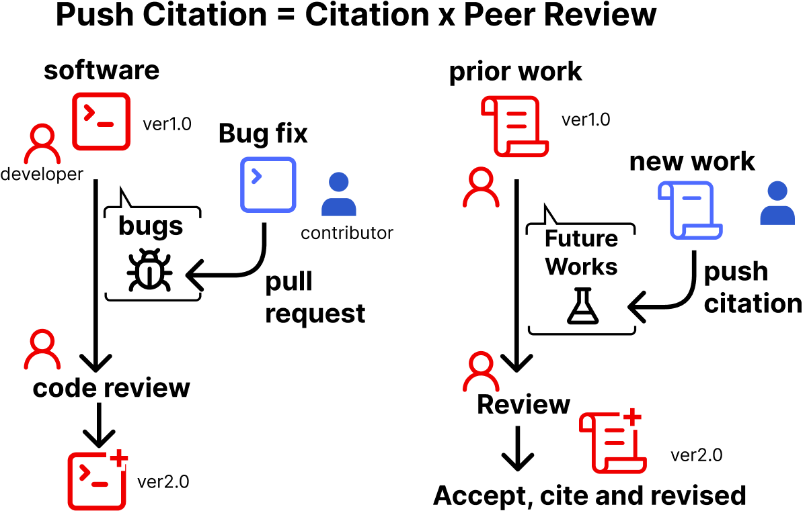
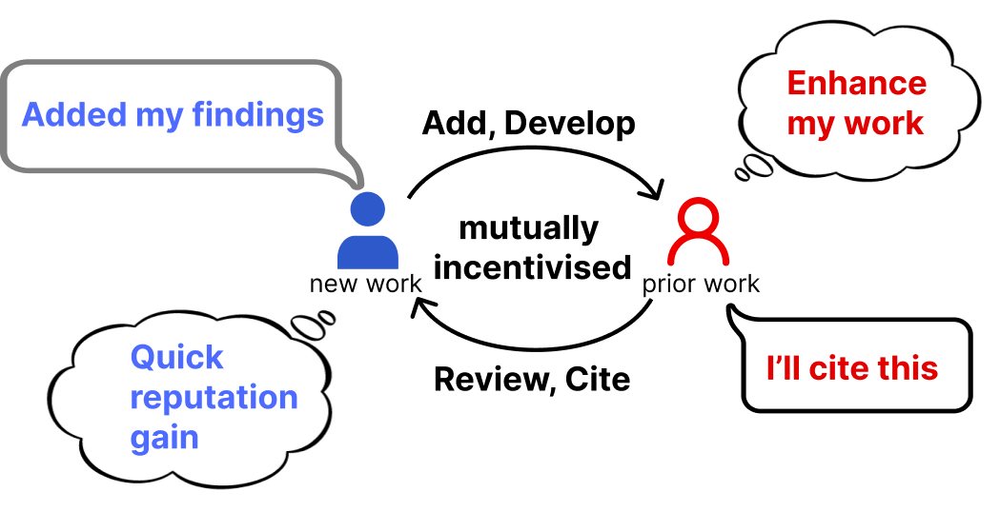

Science is everywhere. From choosing the correct shampoo for your hair, to finding a single equation for whole universe.
So understanding the mechanism behind the science is critical. This is where the "science of science" comes in. The discipline must aim to altering every obsolete mechanism of producing human (include other intelligent agents) knowledge.
It's like you are a factory owner who replaces an old manufacturing machine with a brand new one.
It now ceases less frequent, works more efficiently, and understand your need better. You can now produce more with less.
<!-- However, currently so huge agent resource, including human resaerch time are wasted.  -->

Science is an evolutionary process. Knowledge grows on its direct antecedents, and a mixture of diverse (yet close enough so that they can *breed*) intelligence produce fitter individuals.
Therefore designing the fitness landscape of knowledge is crucial.

<!-- selection process a tiny bacteria to breathe, birds to fly, and humans to communicate.
In the same way, science can cover and answer any of the questions we are facing. -->

# Information quality control is essential for distributed science.

This is why I'm doing research on distributed knowledge productions and peer review innovations. Peer review is a selection process to determine which knowledge should be valued. We need a comprehensive understanding about what forms and updates the consensus within scientific communities.
The main contribution of my research is "push citation", a reversed citation from prior work to newer, combined with a improvement proposals for the prior research.
For more detail, visit "Works" page.

<!-- Information Quality Control can learn more from Open Source Software Development. -->
<!-- My research focus is on distributed knowledge contribution system. -->

Get in touch with any of the following contacts:
- t.miura@gnt.place
- isakata@ipr-ctr.t.u-tokyo.ac.jp