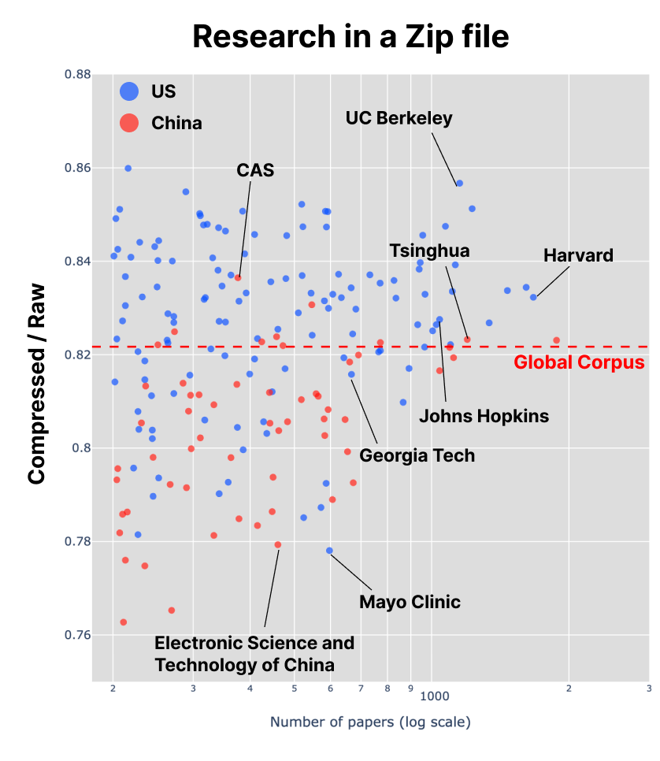

Every university has its own research strength and norms — a unique mixture of ideas, vocabularies, and disciplinary codes. 
Epistemic diversity is often celebrated as a hallmark of vibrant academic institutions, fostering innovation and cross-pollination of ideas.
University administrators are increasingly interested in fostering interdisciplinary research, and identifying the measures that can cultivate, sustain, or restore the strength of research ecosystems.

Many researchers have tried to quantify this diversity, but it’s a tricky problem. Most publishers use subject classification systems to tag research articles: WoS category and ASJC to name a few. However, these systems are coarse-grained and often inconsistent granularity across disciplines. Many discipline has its own coding — physics has PACS, astrophysics has AAS, biology and medical sciences have MeSH terms, economics has JEL. But there are many disciplines that lack such coding systems. Recent advances in interdisciplinary research make it even harder to classify research into discrete categories.

## What if we could sequence a "research DNA"?

You may have noticed that this problem shares the same structure as the one faced by the naturalists in the 18th century: we inaugrated a glorious, discrete classification of living organisms from species to kingdom, but how do we define the diversity of an environment? It was apparently an easy task. Go outside, circle a rope in a meadow, and count how many distinct species are there. If you want, you can also compensate the number by accounting for the closeness in the phylogenetic tree.
As their understanding of evolution deepened, naturalists began to doubt whether sheer species count in your backyard of overabundant generalists could appear more diverse than those in a hydrothermal vent at the bottom of the ocean — or even a tropical rainforest.

They solved this problem by sequencing the DNA of organisms in the environment, and analyzing the genetic diversity directly from the sequence data. If the samples came from Home Depot, you might find distinct yet narrowly distributed genotypes. That would paint a very different picture of biodiversity than if you had them in a pristine forest.

## A Thought Experiment: Compressing Research Output
Imagine that the university is a living environment where its research output inhabit. Researchers produce knowledge by interacting with each other, sharing ideas, and building on past work. This ecosystem shapes the research culture and diversity of the institution. Of course not all departments are communicating, but they share the same resource pool: funding, administration, physical space, and institutional policies.
What if we could read the genome of research, not by running PCR, but by analyzing sequence of words?

Instead of cataloguing appearances, biologists analyzed strings of nucleotides, treating each environment as a long piece of code. 
What matters is not the number of organisms, but the redundancy and unpredictability of their sequences — in other words, how much information can be compressed without loss.
This is precisely how we might think about research output.
If it compresses easily, the writing is repetitive — many papers reusing similar phrases, methods, and concepts.
If it resists compression, the writing is diverse — a sign of many unrelated ideas 

In other words,
> "If you take all of your university research output and zip it into a single file, how much smaller does it get?”

## From Words to Complexity
The intuition follows Kolmogorov Complexity: the shortest possible description of an object represents its true information content.
Of course, we can’t compute true Kolmogorov complexity, but compression algorithms like gzip offer a practical proxy.

To make this meaningful for text, I took all the paper abstracts published by each institution in a period of 2010-2015, then each paper’s abstract was tokenized into words, mapped to unique integer IDs.
The ratio of compressed size to raw size — incompressibility — can be a numerical signature of “research diversity.”
Higher incompressibility corresponds to unpredictable word patterns, with which we thus expect that the institutions holds broader research scopes and interdisciplinary cultures.

Each point in the figure plots single institution's incompressibility against the total number of papers they produced.
Red broken line shows incompressibility of the entire corpus of research output aggregated from all institutions.

When applied across thousands of institutions, the result, to my surprise, was highly robust.
Little correlation with the number of papers, and the larger institutions tend to be less compressible. This is intuitive: larger universities tend to have many departments that naturally contain a wider range of disciplinary vocabularies.

Several things should be noted. First, their values never converged to that of the global corpus as the number of works increased — the “Earth” of all research outputs combined. If you sequenced the DNA of every species on the planet, you would obtain the most diverse sequence imaginable.
The paradox may arise from the perception of diversity itself — what it really means to be diverse.
Instead of counting many kinds of things within an environment, we are measuring how surprising and unpredictable their combinations are.
If you take the entire universe as your sample, you will indeed find lakes, deserts, forests, and the organisms that adapted to them — but also the patterns that make them collectively predictable.

Second, are we measuring lexical diversity, or epistemic diversity?
Compression algorithms are sensitive to word choice and syntax, so a text with varied vocabulary and complex sentence structures may appear less compressible regardless of its underlying ideas.
Thus, incompressibility may reflect both linguistic style and conceptual breadth.

From semantic comparison, one could argue that European institutions should be more compressible, given that decades of policy coordination under the EU research frameworks have produced a shared language of grant proposals, reports, and academic writing.
Moreover, because English is used as a second language across most of Europe, researchers tend to converge on a stable, “safe” vocabulary and structure — one that is grammatically consistent and stylistically narrow.
On the other hand, when considering the institutional landscape and the structure of specialization, European universities inherit the intellectual DNA of liberal education — a tradition that values breadth, synthesis, and the ideal of the “Renaissance man.”
Their structures favor horizontal movement across disciplines, producing research languages.
By contrast, the American university system, born out of industrial specialization, optimized for vertical depth and efficiency.

Further analysis revealed that institutions in European countries tend to be less compressible than those in the US. This suggests that, despite a more standardized academic language, our instrument might be pointing the other way — measuring conceptual structure rather than linguistic surface.

## Science as an Evolving Creature
“Research diversity” has traditionally been measured using indices like Shannon Entropy or Rao–Stirling Diversity, focusing on categorical distributions of topics or citations.
The compression-based approach, in contrast, views research output as a living corpus — an evolving language system whose redundancy (or lack thereof) reflects underlying cognitive diversity.

Next steps will involve comparing this (approximate) Kolmogorov complexity of text with conventional diversity indices, and examining whether certain ecosystems — disciplines, countries, funding models — naturally evolve toward more compressible or more chaotic knowledge structures.

Below is an interactive plot showing the incompressibility of research across global universities. Feel free to explore how different institutions position themselves across the landscape - assuming it loads properly as my blog sometimes decides to crash my scripts. I would be happy to hear your thoughts on LinkedIn!

  <iframe
    src="/diversity_scatter.html"
    style="width: 100%; min-height: 800px; border: none; overflow: visible;"
    scrolling="no"
  ></iframe>

References
- Li, M. & Vitányi, P. (2008). An Introduction to Kolmogorov Complexity and Its Applications. Springer.
- Faith, D. (1992). Conservation evaluation and phylogenetic diversity. Biological Conservation, 61(1), 1–10.
- Shannon, C. E. (1948). A Mathematical Theory of Communication. Bell System Technical Journal, 27(3), 379–423.
- Rao, C. R. (1982). Diversity and dissimilarity coefficients: A unified approach. Theoretical Population Biology, 21(1), 24–43.
- Stirling, A. (2007). A general framework for analysing diversity in science, technology and society. Journal of the Royal Society Interface, 4(15), 707–719.

Methodology and Data Availability
The data used in this analysis were obtained from the OpenAlex snapshot taken at April 2025. Abstracts those are not in English or contain less than 50 characters are omitted. At most one institution is assigned to each article, inferred from the first institutions of the first author. Institutions with fewer than 200 papers were excluded to ensure statistical robustness. The incompressibility calculations were performed using Python's gzip library on tokenized abstracts.

Cite this work as:
Miura, C. (2025). DNA Barcoding of Research Diversity. MillePhilosoph. https://doi.org/10.6084/m9.figshare.30393655

* The raw incompressibility of this post is approximately 0.99, which is disproportionately high given the quality of rushed writing on the Sunday morning. This may be due to gzip overhead.